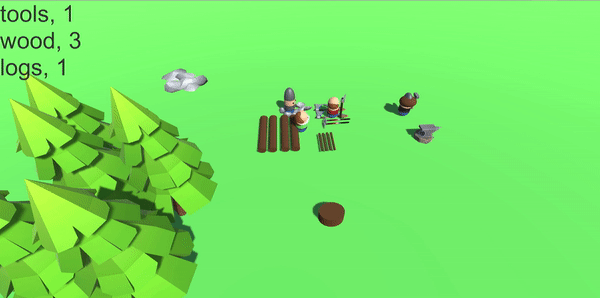

# IA-Prototipo-GOAP
Prototipo para la asignatura Inteligencia Artificial en Videojuegos

## Mining Madness

## Actores

Minero: Se encarga de coger minerales y depositarlos en la pila
Leñador: Se encarga de cortar troncos y depositarlos en la pila
Corta Leña: Se encarga de cortar los troncos en madera y depositarlos en la pila
Herrero: Se encarga de gastar los materiales y depositar herramientas

Cuando un obrero recolecta su material se le rompe la herramienta, cuando hayan herramientas disponibles puede ir a la pila de herramientas para seguir recolectando.

El herrero gasta 3 de madera y 3 de rocas para crear 3 herramientas.

